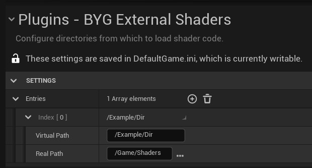
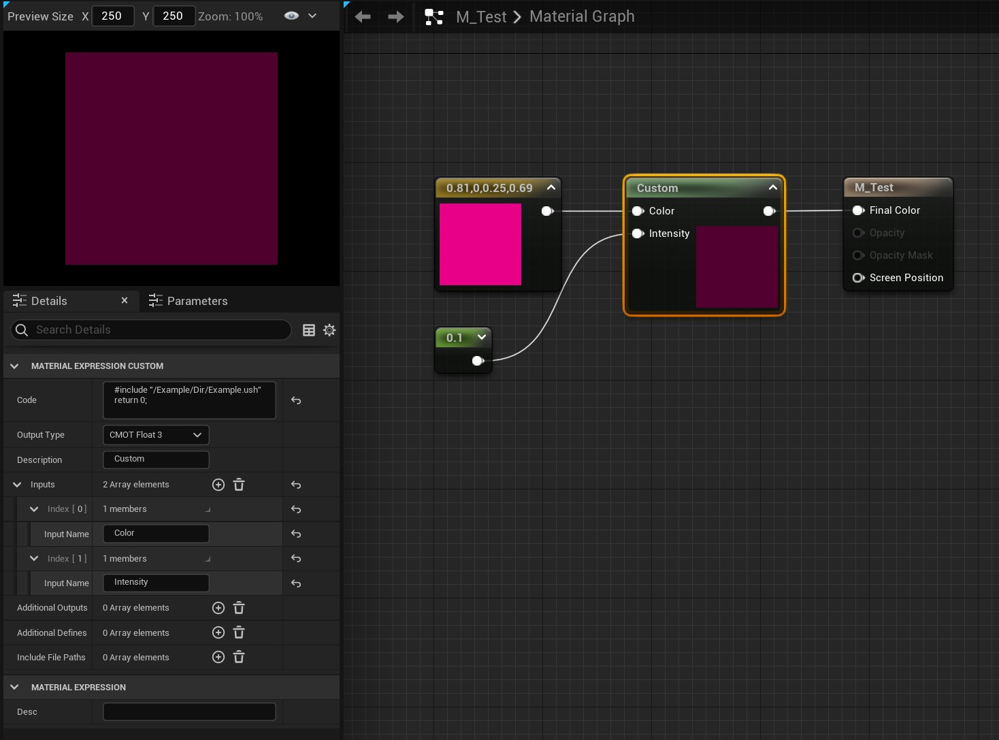

# BYG External Shaders

Allows specifying multiple directories in `Project Settings` from which to load shader files.
This means you can write all your shader code using an external tool, rather than inside Unreal's little code box.

## Usage

1. Under `Project Settings > BYG External Shaders`, add an entry to the Entries array. Pick a directory that you want to
use to store your shader code files. It should be somewhere inside your `Content` directory. 
   * The "Virtual Directory" path is the path you will use in your custom node code when including external shaders.
   * **Note** Because of _reasons_ you will have to restart Unreal after any changes to this config.



2. Inside the "Real Directory" that you specified, create a new `.ush` file. For example `/Game/Shaders/Example.ush`:

```cpp
float4 OutColor = mul(Color, Intensity);
return OutColor;
```

4. Back in Unreal, create a new Material asset.

5. Inside the material, create a Custom Node. Inside its properties you should see `Code`. Put this inside:

```cpp
#include "/Example/Dir/Example.ush"
return 0;
```

6. The rest of the material should look like this:



7. Wow you're done!

## FAQ

### Q: Help I've got `error X3000: syntax error: unexpected toaken '#'`

In your custom node, you've probably just entered:
```cpp
#include "/Example/Dir/Example.ush"
```
This is wrong. You need to add `return 0;` at the end. This is correct:
```cpp
#include "/Example/Dir/Example.ush"
return 0;
```

### Q: How do I force my code to re-compile?

Hit `Shift+Enter` inside the custom node code text to make it re-evaluate.

### Q: Can I name my files with extensions other than `.ush`?

Unreal only wants `.ush` or `.usf`, sorry.

## Thanks

Massive thanks to [@codekittah](https://twitter.com/codekittah) who did 99.9% of the work with
her [CustomShaderDirectoryExample repo](https://github.com/Sythenz/CustomShaderDirectoryExample)
and [YouTube tutorial](https://www.youtube.com/watch?v=V3BVsYV7ge0).

This plugin takes those and adds the Project Settings stuff around it.

## License

[3-clause BSD license](LICENSE)

## Contact

Created and maintained by [@_benui](https://twitter.com/_benui) at [Brace Yourself Games](https://braceyourselfgames.com/)
